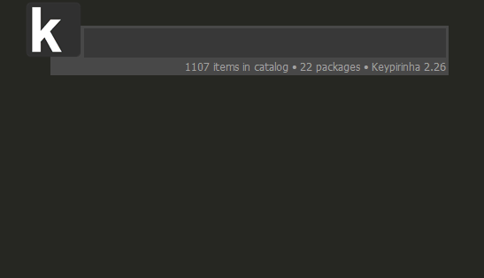

# Keypirinha Plugin: Jenkins

This is Jenkins, a plugin for the
[Keypirinha](http://keypirinha.com) launcher.

This plugin is meant for (as of now) searching and launching Jenkins jobs in browser as quickly as possible.
From `v2.1.0`, it supports searching jenkins agents and labels.

Supports multi section configuration, so searching more than one Jenkins is possible.

## Usage

The command name is itself is configurable. However, if not configured, it will be named as follows.

| command                 | function                                                                                   |
|-------------------------|--------------------------------------------------------------------------------------------|
|`Jenkins-<section_name>:`   (though it can be changed)             | [[Requires configuration](#Configure)] Search and navigate jenkins jobs                    |
|`Agent-<section_name>:`   (though it can be changed)             | [[Requires configuration](#Configure)] Search and navigate jenkins agents                     |

#### Sample (with [this](sample_config_file.ini) config):

## Download

Download the latest release from [here](https://github.com/mrraj470/keypirinha-jenkins/releases).

## Install

### Using [package control](https://github.com/ueffel/Keypirinha-PackageControl)

* Type `Install Package`, and click enter.
* Type `Keypirinha-Jenkins`, choose one named `mrraj470`, and click enter.

### Manual Installation

Once the `Jenkins.keypirinha-package` file is downloaded, move it to the `InstalledPackage` folder located at:

* `Keypirinha\portable\Profile\InstalledPackages` in **Portable mode**
* **Or** `%APPDATA%\Keypirinha\InstalledPackages` in **Installed mode** (the final path would look like
  `C:\Users\%USERNAME%\AppData\Roaming\Keypirinha\InstalledPackages`)

## Configure

Please refer the config file for configuration documentation. Also see
this [`sample config file`](sample_config_file.ini) for reference.

## License

This package is distributed under the terms of the MIT license.

## Icon credits

* [Folder](https://icons8.com/icon/41649/folder) icon by [Icons8](https://icons8.com)
* [Computer](https://icons8.com/icon/fEvszKDe3hzp/computer) icon by [Icons8](https://icons8.com)
* [Label emoji](https://icons8.com/icon/EeRabdM4bHJn/label-emoji) icon by [Icons8](https://icons8.com)
